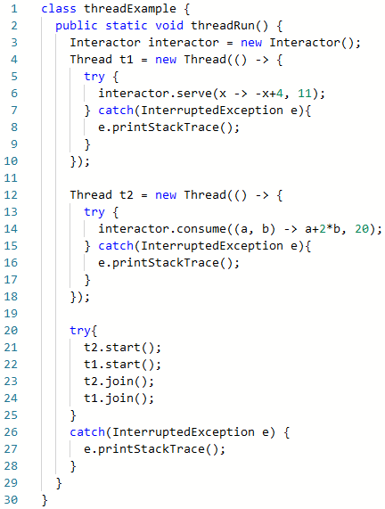

Task 1 

Create ParallelCalculator class that will be able to execute an operation in parallel thread.

Use the implementation of Runnable interface for this.

Constructor of ParallelCalculator should take 3 parameters: 

1)The BinaryOperator<Integer> to define an operation that will be executed, 
2)The operand1 of type int and operand2 of type int.

The ParallelCalculator class should have not  private result field of type int where the result of the operation will be written when it's executed.

Task 2

Suppose, you have class from task #1 ParallelCalculator that is able to execute an operation in separate thread. It uses an implementation of Runnable interface for this.

You need to create Accountant class with a static sum(...) method that takes two parameters of type int and returns their sum. Use ParallelCalculator for this. The sum(...) method doesn't throw any checked exceptions.

The sum must be evaluated in a separate thread  (please, do not call run() method of ParallelCalculator. Use start() method on object of type Thread).

Using Thread.sleep() method is unwelcomed in this task.

Task 3

Suppose, we have the next class:

You need to implement the methods of the Interactor class so that output will look like this:
Serving thread running
Serving thread initializes the key
key = -7
Consuming thread received the key. key = -7
Consuming thread changed the key. key = 33
Serving thread resumed

The serve(...) method should initialize the x field with applied its first parameter to the second one and print the messages only about its own actions.

The counsume(...) method should wait until serve initializes x field and then change x by assigning it the result of applying the method's first parameter to the second and the third ones. This method also prints the messages only about its own actions.

Assume that the consume(...) method should be able to execute without the serve(...) method after waiting for 3 seconds.

Use synchronized blocks (or methods), wait() and notify() methods for the implementation.
